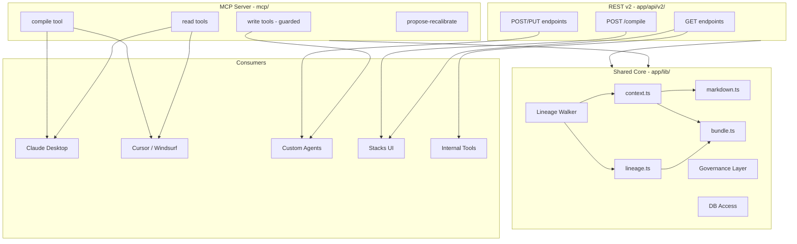

# Agentic Stacks: API + MCP Server

> Build shared core modules (lineage walker, compile engine, governance layer), then expose them simultaneously as an MCP server (for Claude/Cursor/agent-native access) and REST API v2 (for tools/UI/webhooks). Agents can read, compile, and create — but never silently mutate canonical content.

## Current State

- Two overlapping API layers: `/api/db/*` (legacy CRUD) and `/api/v1/*` (phase0, typed)
- Data lives in `data/data.json`, accessed via `app/lib/db/index.ts` and `app/lib/phase0/db.ts`
- Lineage is stored inline: `derivedFrom: string[]` on syntheses, `informedBy: string[]` on artifacts
- Movement events have types (`app/lib/movement/types.ts`) but use mock data — not persisted
- `PrepareForAgentDrawer.tsx` exists with compile options but the callback is a `console.log` TODO
- Export (`app/lib/export.ts`) supports docx/txt/md/html — client-side only

## Architecture



## Governance Rules (baked into write layer)

Every write function in the core accepts an `actor` parameter:

```ts
type Actor = { kind: "user"; id: string } | { kind: "agent"; id: string; name?: string };
```

**Rules for `agent` actors:**

- **Create** — allowed: new sources, syntheses, artifacts, edges
- **Edit** — forbidden on canonical content; creates a new version instead, linked to the original via a `supersedes` edge
- **Recalibrate** — creates a `proposed_recalibration` draft with a diff preview; does NOT auto-apply
- **All mutations** — automatically emit a persisted `MovementEvent` with `createdBy: "agent:<id>"`

## Phase 1: Core Foundation

### 1a. Lineage Walker (`app/lib/lineage/walker.ts`)

Recursive graph traversal — the current codebase only does 1-hop filters. This module supports configurable depth:

```ts
walkLineage(nodeId: string, items: SpineItem[], opts: {
  direction: "upstream" | "downstream" | "both";
  depth: number | "full";
}): LineageGraph
// Returns: { nodes: SpineItem[], edges: { from: string, to: string, rel: string }[] }
```

Uses `derivedFrom` / `informedBy` arrays to walk the graph. Handles cycles via visited-set.

### 1b. Governance + Movement Persistence (`app/lib/governance.ts`)

- `Actor` type definition
- `guardedCreate()` — wraps create operations, emits movement event
- `guardedUpdate()` — for user actors: update in place; for agent actors: create new version + `supersedes` edge
- `proposeRecalibration()` — creates draft + diff, returns proposal object
- `persistMovementEvent()` — writes to `data/data.json` movements array (replace mock data)

### 1c. Response Envelope (`app/lib/api/envelope.ts`)

```ts
type ApiOk<T> = { ok: true; data: T; meta: { ts: string; v: "2" } };
type ApiErr = { ok: false; error: { code: string; message: string } };
type ApiResponse<T> = ApiOk<T> | ApiErr;
```

Helpers: `ok(data)`, `err(code, message, status)`.

## Phase 2: Compile Engine (`app/lib/compile/`)

All compilers are pure functions that take data in, return structured output. No HTTP, no side effects.

### 2a. `context.ts` — builds `context.json`

- Accepts `nodeId`, `scope`, `target`, items array
- Uses lineage walker for scope resolution
- Outputs structured JSON: artifact metadata, upstream chain, source content, optional task list (for `target: "agent"`)
- Reuses `tiptapToText()` from existing `export.ts` for content extraction

### 2b. `markdown.ts` — builds `stack.md`

- Accepts the context object from `context.ts`
- Renders human-readable markdown: title, status, lineage summary, full content, source attributions

### 2c. `lineage.ts` — builds `lineage.json`

- Thin wrapper around the lineage walker
- Outputs `{ nodes: [...], edges: [...], root: nodeId, scope: "..." }`

### 2d. `bundle.ts` — builds `bundle.zip`

- Uses JSZip to package `context.json` + `stack.md` + `lineage.json`
- Returns a `Buffer` / `Uint8Array`

## Phase 3a: MCP Server (`mcp/`)

Standalone TypeScript process using `@modelcontextprotocol/sdk`. Runs via `bun run mcp/server.ts` (stdio transport for local tools, SSE for remote).

**Resources** (browsable context):

- `stacks://fieldbooks` — list all fieldbooks
- `stacks://fieldbooks/{id}` — single fieldbook summary
- `stacks://fieldbooks/{id}/nodes/{nodeId}` — node content

**Tools** (actions):

- `search_stacks` — full-text search across fieldbooks (query, optional type filter)
- `get_context` — compile context for a node (calls compile engine). Params: `fieldbookId`, `nodeId`, `scope`, `target`, `format`
- `list_nodes` — list all nodes in a fieldbook with types and titles
- `get_lineage` — get lineage graph for a node
- `create_source` — add a new source (governed: emits movement event)
- `propose_edit` — create a new version of a node (governed: never overwrites canonical)
- `propose_recalibration` — propose recalibration of a synthesis/artifact (returns draft + diff)

Config for Claude Desktop / Cursor:

```json
{
  "mcpServers": {
    "stacks": {
      "command": "bun",
      "args": ["run", "/path/to/fieldbook/mcp/server.ts"]
    }
  }
}
```

## Phase 3b: REST API v2 (`app/api/v2/`)

Thin HTTP wrappers around the same core modules. All responses use the envelope.

**Read:**

- `GET /api/v2/fieldbooks` — list fieldbooks
- `GET /api/v2/fieldbooks/:id` — single fieldbook
- `GET /api/v2/fieldbooks/:id/nodes` — all nodes (flat list with type/title/status)
- `GET /api/v2/fieldbooks/:id/nodes/:nodeId` — single node with content
- `GET /api/v2/fieldbooks/:id/lineage` — full graph
- `GET /api/v2/fieldbooks/:id/lineage/:nodeId?depth=1|full` — node subgraph

**Write (governed):**

- `POST /api/v2/fieldbooks/:id/sources` — create source
- `POST /api/v2/fieldbooks/:id/nodes/:nodeId/versions` — create new version (not PUT — versions, not overwrites)
- `POST /api/v2/fieldbooks/:id/nodes/:nodeId/propose-recalibration` — propose recalibration

**Compile:**

- `POST /api/v2/fieldbooks/:id/compile` — dispatch to compile engine, returns result by format

All write endpoints accept an `X-Actor` header: `user:<id>` or `agent:<id>:<name>`. Governance rules applied accordingly.

## Phase 4: Wire UI

### 4a. PrepareForAgentDrawer

- On "Compile", call `POST /api/v2/fieldbooks/:id/compile` with selected options
- Download result (json/md file, or zip for bundle)
- Show toast confirmation

### 4b. Export Dropdown Overhaul

- Remove: docx, html
- Keep: Markdown, Plain Text
- Add: JSON (raw FieldbookDocument)

## File Inventory

**New files:**

- `app/lib/lineage/walker.ts` — recursive lineage traversal
- `app/lib/governance.ts` — actor types, guarded mutations, movement persistence
- `app/lib/api/envelope.ts` — response types + helpers
- `app/lib/compile/context.ts` — context.json builder
- `app/lib/compile/markdown.ts` — stack.md builder
- `app/lib/compile/lineage.ts` — lineage.json builder
- `app/lib/compile/bundle.ts` — zip packager
- `mcp/server.ts` — MCP server entry point
- `mcp/tools/read.ts` — search, list, get tools
- `mcp/tools/compile.ts` — get_context tool
- `mcp/tools/write.ts` — create_source, propose_edit, propose_recalibration
- `mcp/resources/fieldbooks.ts` — fieldbook/node resources
- `app/api/v2/fieldbooks/route.ts`
- `app/api/v2/fieldbooks/[id]/route.ts`
- `app/api/v2/fieldbooks/[id]/nodes/route.ts`
- `app/api/v2/fieldbooks/[id]/nodes/[nodeId]/route.ts`
- `app/api/v2/fieldbooks/[id]/nodes/[nodeId]/versions/route.ts`
- `app/api/v2/fieldbooks/[id]/nodes/[nodeId]/propose-recalibration/route.ts`
- `app/api/v2/fieldbooks/[id]/lineage/route.ts`
- `app/api/v2/fieldbooks/[id]/lineage/[nodeId]/route.ts`
- `app/api/v2/fieldbooks/[id]/compile/route.ts`

**Modified files:**

- `app/lib/export.ts` — remove html/docx, add JSON
- `app/components/ExportDropdown.tsx` — update format options
- `app/components/PrepareForAgentDrawer.tsx` — wire to compile API
- `app/lib/movement/types.ts` — add `proposed_recalibration` and `version_created` event types
- `data/data.json` — add `movements` array to fieldbook schema
